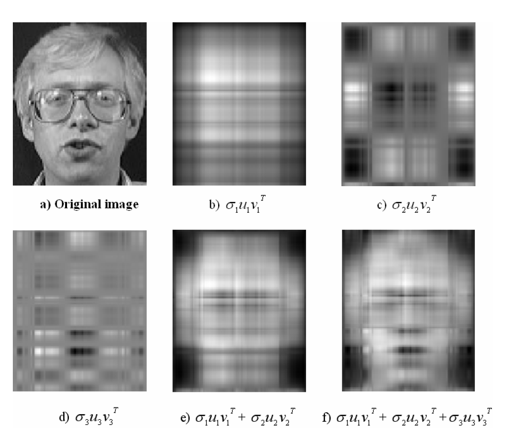

# SVD + HMM for Face Recognition
文献名称：
+ [Face recognition using Singular Value Decomposition and Hidden Markov Models](http://www.wseas.us/e-library/conferences/2014/Lisbon/TAMAM/TAMAM-21.pdf)
+ [A New Fast and Efficient HMM-Based Face Recognition System Using a 7-State HMM Along With SVD Coefficients](http://ijeee.iust.ac.ir/files/site1/user_files_5e3495/ijeee-A-10-3-34-9550f50.pdf)

# Face Recogniction
通常，人脸识别的过程是：给定一些训练集，通过学习训练集的特征，从而预测测试集的人脸类别。通常人脸图片由一个二维的像素矩阵构成，每个像素点都是一个位于[0,255]之间的实数。常见的机器学习模型是将图片矩阵作为输入，学习数据之间的表征，最后预测新的人脸类别。

# Hidden Markov Models (HMM)
隐马尔科夫模型(HMM)是一个统计模型，可将系统建模为一个含有隐藏状态的马尔科夫过程。
马尔科夫模型主要由两个部分组成：
+ 观测状态：观测状态是我们可以观测到的系统状态，比如：今天晴天，下雨，多云等状态
+ 隐状态：隐状态是我们不一定可以观测到的状态，隐状态决定了观测状态的发生，同时隐状态之间具有一定的关系

基于两个重要的假设：
+ 假设1：
+ 假设2：

基于上述两个假设，马尔科夫模型由三个重要的参数决定：
+ $\pi$:隐状态的概率分布
+ $A$: 隐状态之间的状态转移概率矩阵
+ $b$: 由隐状态产生观测状态的发射概率矩阵

一个常见的马尔科夫模型如下图所示：

# Singular Value Decomposition (SVD)
奇异值分解(SVD)是一种很常用的降维方法，通过将一个矩阵分解为三个矩阵，从而提取数据的主要特征，同时降低了数据的维度，通常来讲，SVD可以表示为如下的过程：
$$
M=U\Sigma V^T
$$
其中$\Sigma$是一个对角矩阵，对角线上的值为矩阵的奇异值，其值得大小说明了该维度对矩阵的“贡献”程度。

# Question
通常，SVD用于降维，隐马尔科夫模型用于**离散**序列模型，如何将二者结合起来应用在人脸识别任务上？

# Methodology
为了构建一个离散的隐马尔科夫模型，需要将图片“序列化”。

## Resize
对于一张输入的图片，需要进行一定的预处理，比如将图片缩放。例如，原图片大小为112X92，原作者将其缩放为原来大小的一半，即56X46。这样做的目的是一方面减少数据规模大小，另一方面可以达到一定的去噪处理（图片太大的话会含有很多无用信息影响模型训练）

## Filter
噪声是图像干扰的重要原因。一幅图像在实际应用中可能存在各种各样的噪声，这些噪声可能在传输中产生，也可能在量化等处理中产生。因此，将图片缩放完成后，接下来还要将其通过一个最小值滤波器做进一步的降噪处理，最小值滤波器的作用原理如图所示：

现在看看将一个最小值滤波器作用到图像上的效果：

可以看到经过滤波器后，图像虽然看起来模糊了些，但主要信息仍然存在，同时更加“平滑”了。

## Block Extraction
将图片经过上述处理完成后，我们还需要将其转化成一个个block，用于后面构造序列。
作者对于block的提取方法是，取每个block的宽$W$为图像的原宽，然后设定每个block的高度为$L$，有重叠的提取block。那么，一张图片可以提取出多少块呢？假设图像的高为$H$，宽为$W$，每个block的高度为$L$，block之间重叠的部分高度为$P$，如下图所示：

那么，每张图片可以提取的block的数目$T$是：
$$
T=\frac{H-L}{L-P}+1
$$

代入图片数据$H=56,W=46$，同时作者取$L=5,P=4$，则可求得$L=52$。这样一来，每张图片可以转化成52个有重叠的块(block)。

## SVD Extraction
每个块是一个$L\times W$的矩阵，如何从每个块中提取信息呢？这种时候作者想到了SVD，将每个block矩阵作奇异值分解：
$$
H=U\Sigma V^T
$$
得到三个矩阵。观察奇异值矩阵$\Sigma$中各个奇异值的大小，如下图所示：

发现所有奇异值的和几乎约等于前两个奇异值之和，也就是，可以利用前两个奇异值来代表整个矩阵的奇异值。
口说无凭，作者通过利用分解后的矩阵和奇异值对图像进行复原，做了如下实验：

可以发现，最后一张图(f)的复原效果最接近原图，并且只利用了前三个最大的奇异值和对应的三个$U$矩阵和$V$矩阵的向量。

接下来的问题是，如何从中挑选出图片的特征表示？直观上讲，既然前三个奇异值已经包含了大部分的图像信息，那么利用前三个奇异值作为图像的表示不行吗？但是，这样做的话，就会忽略了$U$矩阵和$V$矩阵的信息。关于这一点，作者做了进一步实验，即只利用某个成分来表示图片，进行分类。实验结果是：只使用$U$矩阵的第一个元素，使用最大的奇异值，使用第二大的奇异值，三种情况下的分类效果是最好的。因此，作者将每个block表示为SVD分解后的如下组分：
$$
C=(U(1,1),\Sigma(1,1),\Sigma(2,2))
$$
其中，$U(1,1)$代表$U$矩阵的第一行第一列的元素，$\Sigma(1,1)$和$\Sigma(2,2)$代表奇异值矩阵的两个最大的奇异值。

这样一来，每个block可以由三个实数表示而成。

## Quantization
但是，马尔科夫模型的输入需要的是一个整数序列，因此还需要将输入的三维向量$C$做进一步的“Quantization”处理，也就是将每个实数值映射为一个整数表示。
Quantization 的步骤如下：
+ 假设$C=(coeff_1,coeff_2,coeff_3)$，每个实数映射的整数范围为$D_i$
+ 首先算出每个系数维度最大值和最小值之间的差值相对于$D_i$的大小：
$$
\Delta_i=\frac{\max (coeff_i) - \min (coeff_i)}{D_i}
$$
+ 然后，将每个实数$coeff_i$映射为一个整数$qt_i$：
$$
qt_i =[\frac{coeff_i- \min (coeff_i)}{\Delta_i}] 
$$
其中，$[\cdot]$是向下取整的操作。从而，三个实数就变成了各自对应范围$[0,D_i)$内的整数。
+ 接着，将这三个整数看作一个三位数，那么这三个整数又可以表示为一个整数，其范围为$[0,D_1\times D_2 \times D_3)$，因此转化成一个整数 $label$ 的公式为：
$$
label = qt_1\times D_2 \times D_3 + qt_2 \times D_3 + qt_3
$$

对于$D_i$的取值，作者取其为$[18,10,7]$，这是经过实验选取的最优结果。因此，$label$的公式具体为：
$$
label = qt_1\times 10 \times 7 + qt_2 \times 7 + qt_3
$$
当$qt_i$取最小值都为0时，$label=0$，当其取最大值分别为 17, 9, 6时（因为三个数范围为$[0,D_i)$最大取不到$D_i$的值），$label=1259$最大值，一共有$1260$种情况。

## HMM Model
既然已经将每张图片转化为一个长度为52的观测序列，那么还需要定义隐马尔科夫的隐状态，以及相关参数。作者定义了该模型的七个隐状态，其物理意义为：

也就是将一张图片分为人脸的七个部分，每个部分表示为一个隐状态，每个隐状态可以产生一个由block表示的观测状态。

接着，定义七个隐藏状态的转移概率矩阵初始值。直观上理解，每个隐状态（人脸部位）只有两种转移可能性，即保持不变，或者转移到相邻的下一部位（从上往下看），同时，转移到其他部位的可能性为$0$，例如不可能出现头发的下一部分是嘴巴。隐状态的转移概率如下图所示：

因此，状态转移概率矩阵$A$的初始值为：
$$
A=\begin{bmatrix}
 0.5&0.5  &  &  &  &  & \\ 
 &0.5  &0.5  &  &  &  & \\ 
 &  &0.5  &0.5  &  &  & \\ 
 &  &  &0.5  &0.5  &  & \\ 
 &  &  &  &0.5  &0.5  & \\ 
 &  &  &  &  &0.5  &0.5 \\ 
 &  &  &  &  &  & 1.0
\end{bmatrix}
$$
注：源代码中，作者的初始化为$0.6$和$0.4$。

同时一开始时，我们无法确定隐状态生成观测状态的概率分布，因此将其简单初始化为同一概率，即：

$$
B=\begin{bmatrix}
 1&  1&  1&  1&  \cdots&  \cdots & 1 \\ 
 1&  1&  1&  1&  \cdots&  \cdots & 1 \\ 
 1&  1&  1&  1&  \cdots&  \cdots & 1 \\ 
 1&  1&  1&  1&  \cdots&  \cdots & 1 \\ 
 1&  1&  1&  1&  \cdots&  \cdots & 1 \\ 
 1&  1&  1&  1&  \cdots&  \cdots & 1 \\ 
 1&  1&  1&  1&  \cdots&  \cdots & 1 \\ 
\end{bmatrix}/M
$$
其中$M$为观测状态的可能个数，即1260。

最后，定义初始概率分布：
$$
\pi=\begin{bmatrix}
 1&  0&  0&  0&  0& 0& 0& \\ 
\end{bmatrix}
$$

从而构建好了一个初始化了的隐马尔科夫模型，其参数为$\lambda$：
$$
\lambda=(\pi,A,B)
$$

然后对于数据集中的人脸类别有多少个，就训练多少个对应的隐马尔科夫模型，并取对应的人脸训练模型参数。
例如，该ORL数据集中有40个人(类别)，因此需要训练40个对应的隐马尔科夫模型，每个人对应一个模型，然后对每个模型输入该人对应的训练集图片（转化为序列后）优化模型参数$\lambda$。
最后，预测阶段则是，给定一张图片，将其转化为长度52的序列，计算每个模型产生该序列的概率值，取输出最大值的模型所对应的人，即为该图片的类别。

总结一下整个框架的流程：

# Q & A
## 人脸识别分割7个区域，设计7个状态内涵，为什么？
7 只是一个超参数(hyperparameter)，由于隐马尔科夫模型定义需要**隐状态**，**观测状态**两个部分，作者取隐状态的个数为7，并赋予了其物理意义(人脸7个部分)，然后根据屋里意义构造**初始概率分布**，**状态转移矩阵**，**发射矩阵**三个参数的初始值。当然，隐状态个数可以不为7(例如之前的相关文献设为5)，甚至可以取10，100，1000，只要模型能够取得较好的表现，同时模型复杂度合理(100,1000就相对太大了)，7可以是任何其它数。

## SVD特征值特征提取的内涵？
SVD是将一个给定的矩阵分解成三个矩阵$U$,$\Sigma$,$V$，通过SVD对数据的处理，我们可以使用小得多的数据集来表示原始数据集，这样做实际上是去除了噪声和冗余信息，以此达到了优化数据、提高结果的目的。$\Sigma$对角线上的元素为矩阵的奇异值（特征值），奇异值可以被看作成一个矩阵的代表值，或者说，奇异值能够代表这个矩阵的信息。当奇异值越大时，它代表的信息越多。同时，奇异值下降是非常快的，因此可以只取前面几个奇异值，便可基本表达出原矩阵的信息。因此，在该论文中，作者只去了前两个最大的特征值即代表了矩阵的大部分信息。

## 为何将每张图片分成52个块？
将图像分成52个块的目的是为了将其作为一个序列表示，从而学习隐马尔科夫模型的参数。52和图片原式大小有关，同时也和选取的重叠部分长度有关。

## 将原式图片缩放及通过最小值滤波器的目的？
由于原式图片相对较大，图片中无用的信息较多，如果将其直接作为原始数据输入的话，会造成计算复杂度高，同时噪音也较多，是的模型学习效果较差。将图片进行缩放的原理是使用插值算法，这样可以是的图片中的像素更好地表示图像特征。同时，将其经过一个最小值滤波器，也减少了一定的噪声干扰，使得模型更加专注于图像中的“有用”信息。

## 模型的弊端？
+ **复杂度**
虽然每个人只需要5张图片作为训练即可达到相当高的准确率，但是也有一个缺点就是，数据集中有多少个类别（人）就需要训练多少个马尔科夫模型（该数据集中训练了40个模型）。当数据集较大的时候，训练的复杂度较高，因此需要做出改进。此外，SVD分解的复杂度也较高，虽然每个块的尺寸较小，但是当数据集较多时，数据预处理也会消耗大量时间。

